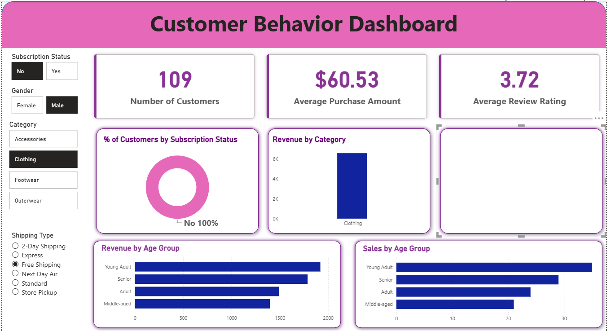

# Customer Shopping Behavior Analysis Using Power BI & Python
By Given By Anudip Foundation

A customer behavior project analyzing 3,900 retail transactions to understand what
drives repeat purchases, customer loyalty, and spending behavior — built to practice the full
analyst workflow from raw data to a stakeholder-ready dashboard.

I built this to get hands-on practice across the tools a Data Analyst role actually uses day to
day: cleaning and transforming data in Python, exporting it to Excel, and turning that analysis
into a dashboard in Power BI.

## Project Overview

The goal was to go from a raw customer dataset to actionable business recommendations, covering:

**Data Preparation & EDA (Python):** Cleaned and transformed the raw dataset — handled missing
values, standardized columns, and engineered features like age groups and a purchase-frequency
signal.

**Visualization & Insights (Power BI):** Built an interactive dashboard highlighting key
patterns and trends — filterable by gender, category, and shipping type.

## Dashboard Preview



The dashboard includes:
- KPI cards for Number of Customers, Average Purchase Amount, and Average Review Rating
- % of Customers by Subscription Status (donut chart)
- Revenue by Category
- Revenue by Age Group and Sales by Age Group
- Filters for Subscription Status, Gender, Category, and Shipping Type

## Repository Structure

| File | Description |
|---|---|
| `customer_shopping_behavior.csv` | Raw dataset |
| `Customer_Shopping_Behavior_Analysis.ipynb` | Python notebook — import, cleaning, EDA, feature engineering, Excel export |
| `cleaned_customer_data.xlsx` | Cleaned dataset exported from Python, used as the Power BI data source |
| `customer_behavior_dashboard.pbix` | Power BI dashboard |
| `Business Problem Document.pdf` | Problem framing and approach |
| `Customer-Shopping-Behavior-Analysis.pptx` | Stakeholder presentation deck |
| `screenshots/Dashboard_ss.png` | Dashboard screenshot (shown above) |

## How to Run This Project

1. **Clone the repository**
   ```bash
   git clone https://github.com/Vivek-kumar-027/Customer_behaviour_analysis_using_python_powerBI
   cd Customer_behaviour_analysis_using_python_powerBI
   ```

2. **Open `Customer_Shopping_Behavior_Analysis.ipynb`**

   Covers:
   - Data import
   - Exploratory data analysis
   - Data cleaning & feature engineering
   - Exporting the cleaned DataFrame to `cleaned_customer_data.xlsx`

3. **Load the cleaned Excel file into Power BI**
   - Open `customer_behavior_dashboard.pbix` in Power BI Desktop
   - Go to **Home → Get Data → Excel workbook**
   - Select `cleaned_customer_data.xlsx` and load the relevant sheet
   - Click **Refresh** to update visuals with the latest cleaned data

4. **Review the report and deck**
   - `Customer Shopping Behavior Analysis.pdf` for the full write-up, recommendations, and
     limitations/next steps
   - `Customer-Shopping-Behavior-Analysis.pptx` for the stakeholder-facing summary